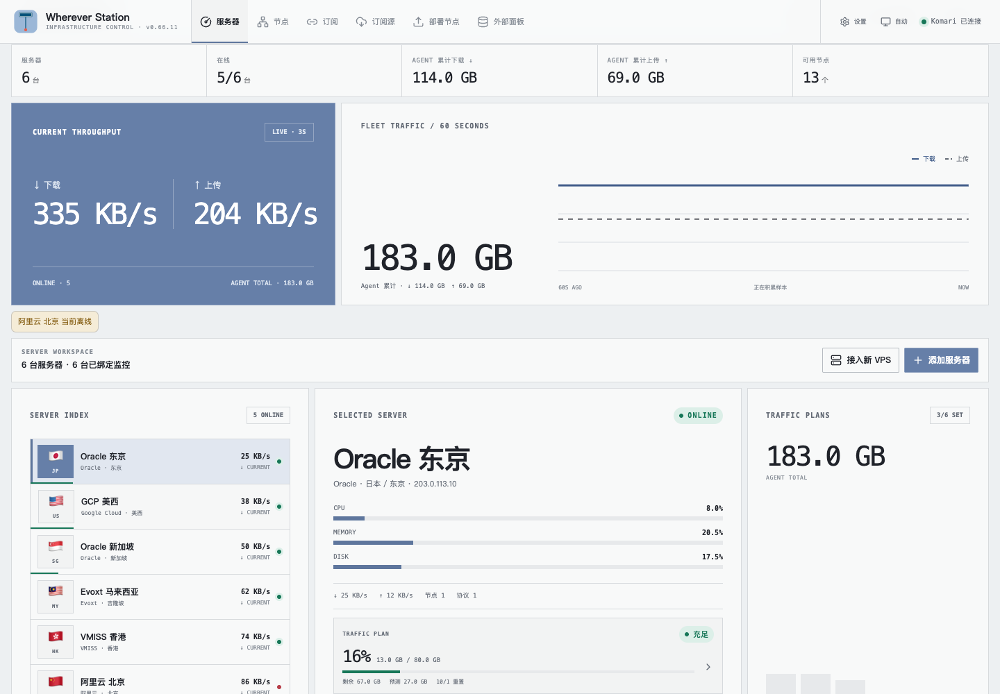
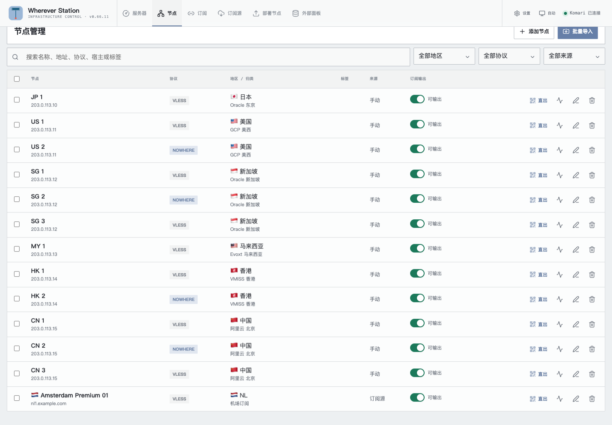
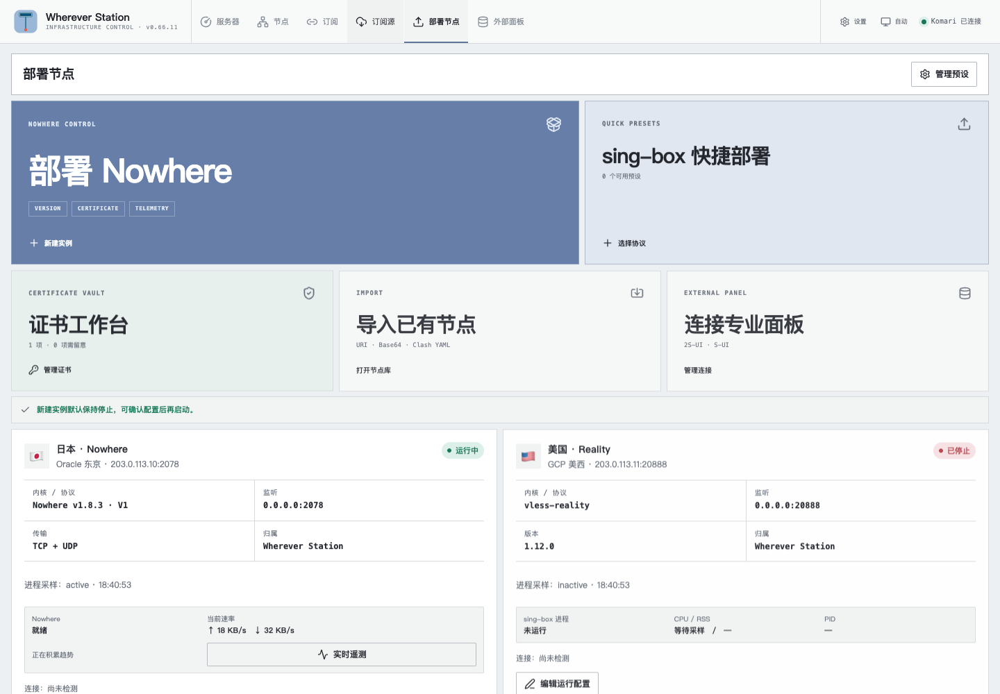

<p align="center">
  
</p>

# Wherever Station

[English](README.md)

[](https://github.com/chikacya/wherever-station/actions/workflows/ci.yml)
[](LICENSE)

Wherever Station 是运行在 [Komari](https://github.com/komari-monitor/komari) 中的自托管节点与订阅工作台。它复用 Komari 的服务器清单、监控指标、登录体系和 Agent 通道，并补充节点整理、订阅输出、轻量托管实例以及专业 sing-box 面板的只读接入。

它的名字也代表产品本身：无论服务器和节点分布在哪里，都可以在这一站汇总监控、整理、部署与订阅需求。Wherever, one station.

Wherever Station 是独立开发的第三方插件，不属于 Komari，也不代表 Komari 官方。仓库不包含 Komari 源码。Komari 使用 MIT License，Wherever Station 使用 GPL-3.0-only，两者分别发布和授权。

## 界面

<p align="center">
  <picture>
    <source media="(prefers-color-scheme: dark)" srcset="docs/assets/screenshots/overview-dark.png">
    
  </picture>
</p>

| 节点库 | 部署工作台 |
| --- | --- |
|  |  |

截图中的服务器与节点均为演示数据。

## 能做什么

- 使用 Komari 数据展示服务器健康、实时上下行、24 小时趋势、月度计数和逐机流量预算。
- 导入 URI 列表、Base64 订阅与 Clash/Mihomo YAML；未知 URI scheme 会原样保存，不会被擅自改写。
- 按标签、国家、宿主整理节点，支持批量命名、排序、复制单节点 URI 和二维码。
- 输出 Raw URI、Base64、Anywhere、Loon、Mihomo、sing-box 和 Surge 订阅，并在生成前显示兼容性检查。
- 支持订阅到期、流量额度、Token 轮换、代理组、基础分流规则和远程规则集缓存。
- 同步外部 HTTP(S) 订阅及标准 `Subscription-Userinfo` 流量信息。
- 通过 `/apiv2` 只读接入 S-UI 和 2S-UI，不修改远端入站、用户、路由或服务。
- 在已连接的 Linux Agent 上创建隔离的 sing-box 快捷实例和托管 Nowhere 实例。
- 为托管实例生成稳定自签证书，或登记目标机已有 PEM 文件。
- 通过显式兼容目录持续跟踪 Nowhere 最新版本，仅在验证完成后开放对应生命周期与迁移操作。

## 不做什么

Wherever Station 不是完整 sing-box 面板，不提供任意入站/出站编辑器、ACME 或 DNS Provider 自动化、多租户计费、公开注册、云防火墙自动变更，也不会自动接管未知的生产代理配置。高级 sing-box 配置应继续使用 S-UI、2S-UI 或其他专业面板，再把客户端分享链接同步到 Wherever Station。

## 运行条件

- Komari `1.4.3` 或更新版本。
- 能够以管理员身份安装并批准 Komari 插件。
- 只有监控、发现、连接检查、服务控制和托管部署需要 Komari Agent；URI 导入和订阅输出可以不接 Agent。
- 托管部署需要带 systemd 和 Python 3 的 Linux；证书操作需要 OpenSSL。

## 安装

在 Komari 的 **插件管理 → 插件市场 → 安装源** 中添加 Wherever Station：

`https://raw.githubusercontent.com/chikacya/wherever-station/main/v1.json`

刷新市场后选择 Wherever Station 安装。新版本发布后，也可以从这个源手动更新；安装和更新时请审核插件权限。

已经有可用的 Komari？可以使用带校验和验证的交互式安装向导：

```bash
bash <(curl -fsSL https://raw.githubusercontent.com/chikacya/wherever-station/main/install.sh)
```

不希望执行网络脚本时，请按下面的手动方式安装，或先阅读[Ciallo～快速开始](docs/QUICKSTART.zh-CN.md)。

1. 从 [Releases](https://github.com/chikacya/wherever-station/releases) 下载 `wherever-station-<version>.zip`。
2. 在 Komari 插件管理中上传 ZIP。
3. 审核并批准 `node`、`allowRoutes` 和 `allowSystemRPC`。
4. 启用插件，从 Komari 侧栏打开 **Wherever Station**。
5. 从三条互不依赖的路径任选其一：导入已有 URI、连接 S-UI/2S-UI，或接入 Komari Agent 进行监控和部署。

Wherever Station 不会生成独立域名，而是复用 Komari 的 HTTP(S) Origin；管理页、全屏页与公开订阅地址的组成方式见[部署指南](docs/DEPLOYMENT.zh-CN.md#地址从哪里来)。反向代理、Agent、备份、升级和数据目录也在该指南中说明。

Komari 主控和 Agent 必须保持协议兼容。不要让 Agent 在主控尚未升级时独自跨版本自动更新；主机指标正常但代理状态不可用时，应首先核对两者版本。

## 文档

| 简体中文 | English | 内容 |
| --- | --- | --- |
| [快速开始](docs/QUICKSTART.zh-CN.md) | [Quick start](docs/QUICKSTART.md) | 从安装到第一条订阅 |
| [部署](docs/DEPLOYMENT.zh-CN.md) | [Deployment](docs/DEPLOYMENT.md) | 安装、Agent 接入、备份、升级 |
| [使用指南](docs/USER_GUIDE.zh-CN.md) | [User guide](docs/USER_GUIDE.md) | 日常操作和界面概念 |
| [完整用户手册](docs/manual/README.zh-CN.md) | [Complete manual](docs/manual/README.md) | 按每个 Tab 分章介绍全部功能与操作 |
| [能力与边界](docs/CAPABILITIES.zh-CN.md) | [Capabilities](docs/CAPABILITIES.md) | 架构、与 Komari 的关系、权限 |
| [协议支持](docs/PROTOCOLS.zh-CN.md) | [Protocol support](docs/PROTOCOLS.md) | 无损透传与结构化转换 |
| [Nowhere 支持](docs/NOWHERE.zh-CN.md) | [Nowhere support](docs/NOWHERE.md) | 版本、生命周期、遥测、迁移 |
| [排错](docs/TROUBLESHOOTING.zh-CN.md) | [Troubleshooting](docs/TROUBLESHOOTING.md) | 常见运行问题 |
| [许可说明](docs/LICENSING.zh-CN.md) | [Licensing](docs/LICENSING.md) | GPL、Komari、依赖与品牌 |
插件内部标识、数据目录和 systemd unit 仍使用早期的 `proxy-console` 名称，以保证已有安装可以原地升级；这只是稳定的兼容标识，产品名称始终是 Wherever Station。

## 隔离与数据

托管实例只写入：

```text
/var/lib/proxy-console/instances/<instance-id>/
```

对应服务名为：

```text
proxy-console-singbox@<instance-id>.service
proxy-console-nowhere@<instance-id>.service
```

它们不会覆盖宿主原有的 `sing-box.service` 或 `nowhere.service`。停用或耗尽订阅不会停止代理进程。插件状态和 Provider 密钥位于 Komari 插件数据目录，应和 Komari 数据库一起备份。Provider Token 只保存在服务端，不会随普通状态接口返回。

## 开发

```bash
npm ci
npm --prefix frontend ci
npm run ci
```

`npm run ci` 会审计生产依赖，运行 Node、Python 和前端测试，构建管理页面，检查版本和许可元数据，并在 `dist/` 生成可重复构建的插件 ZIP。

可选浏览器验收脚本位于 `tools/e2e-*.cjs`。真实环境测试必须显式提供目标和凭据，不会由常规 CI 自动运行。

## 许可证

Wherever Station 使用 [GNU GPL version 3 only](LICENSE)。第三方依赖声明见 [THIRD_PARTY_NOTICES.zh-CN.md](THIRD_PARTY_NOTICES.zh-CN.md)。Komari、sing-box、S-UI、2S-UI、Nowhere、Anywhere、Mihomo、Surge、Loon 等名称归各自权利人所有，本文仅用于说明兼容关系。

安全问题请按[安全策略](SECURITY.md)私密报告，不要在公开 Issue 中粘贴真实订阅链接、Token、私钥或完整节点 URI。
